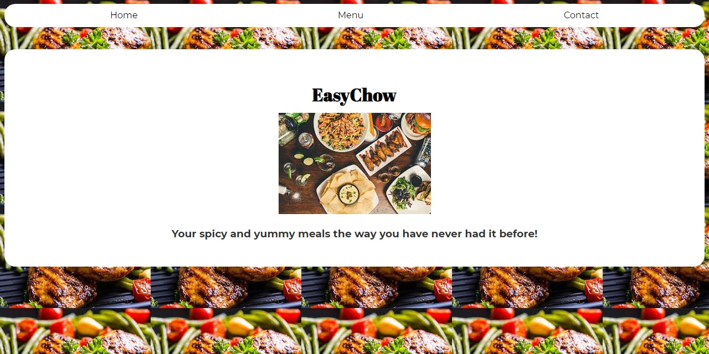
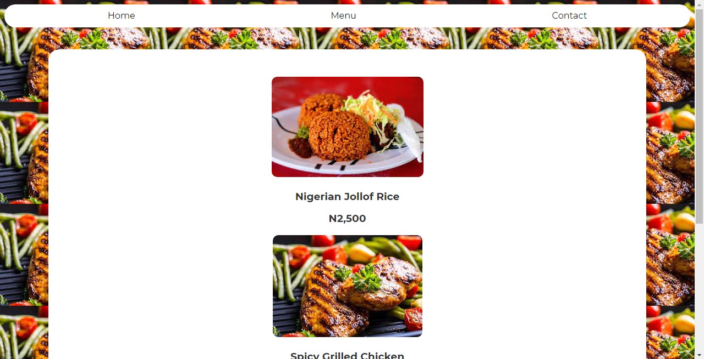

# restaurant-page
ES6 and Webpack project practicing my knowledge of DOM manipulation by dynamically rendering a simple restaurant homepage, using just JavaScript to generate the entire contents of the website.

# Built with
* HTML
* CSS
* Javascript
* Webpack

# Features

## Home Tab

## Menu Tab

## Contact Tab

# Demo
[Live link](https://shadrxcc.github.io/restaurant-page/)

# Author 
👤 **Shadrach Akaade**

- GitHub: [@shadrxcc](https://github.com/shadrxcc)
- Twitter: [@shadrxcc](https://twitter.com/shadrxcc)
- LinkedIn: [Shadrach Akaade](https://www.linkedin.com/in/shadrachakaade/)

## 🤝 Contributing

Contributions, issues, and feature requests are welcome!

Feel free to check the [issues page](https://github.com/ZeenatLawal/Indian-Meals/issues).

## Show your support

Give a ⭐️ if you like this project!